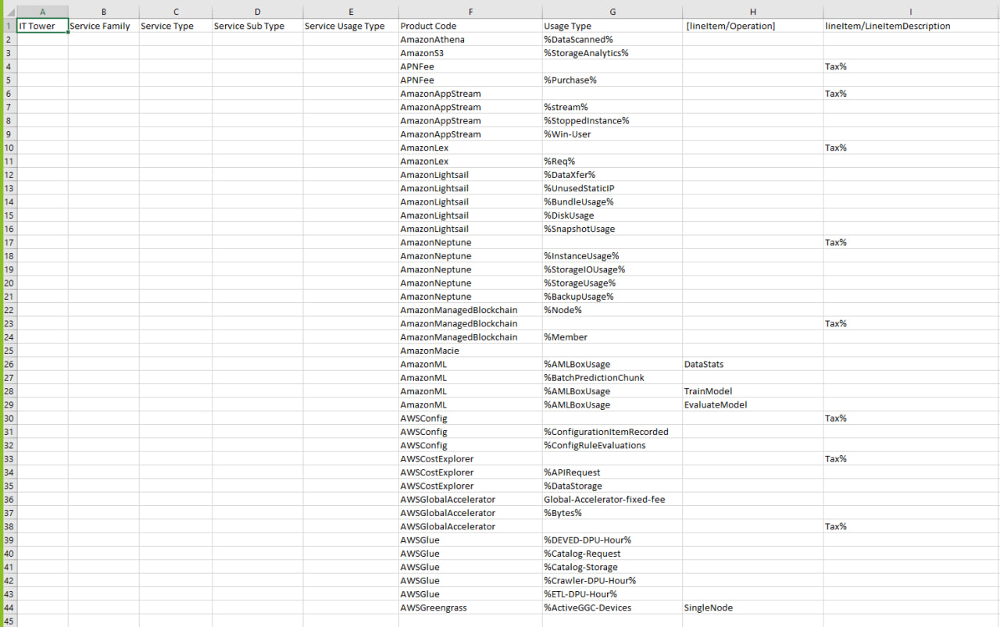
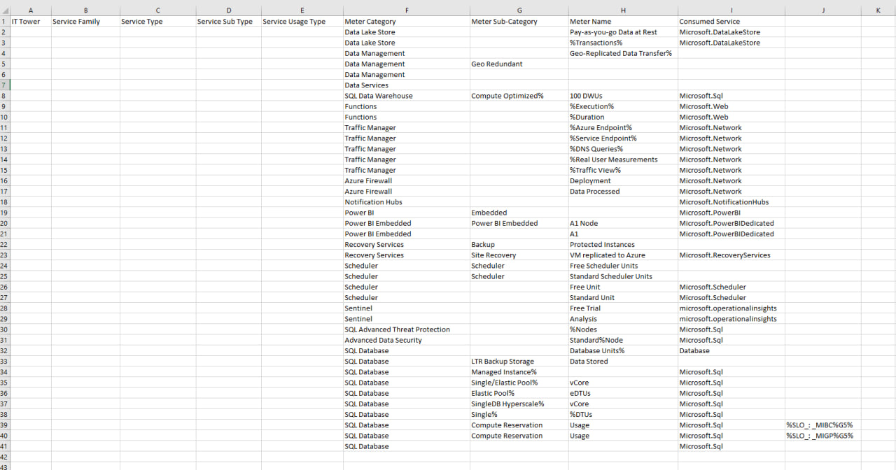

# Аналитическая работа №1 "Знакомство с облачными сервисами"
## Состав команды:

К3243  <- Самсонов Александр Александрович - **капитан**

K3242  <- Мельник Софья Николаевна   

K3240  <- Цой Степан Алексеевич  

К3220  <- Луценко Владимир Витальевич

## Цель работы:

Знакомство с облачными сервисами. Понимание уровней абстракции над инфраструктурой в облаке. Формирование понимания типов потребления сервисов в сервисной-модели. Сопоставление сервисов между разными провайдерами. Оценка возможностей миграции на отечественные сервисы.

## Дано:

1. Слепок данных биллинга от провайдера после небольшой обработки в виде SQL-параметров. Символ % в начале/конце означает, что перед/после него может стоять любой набор символов.
2. Google с документациями провайдера

## Необходимо:

1. Импортировать файл .csv в Excel или любую другую программу работы с таблицами. Для Excel это делается на вкладке Данные – Из текстового / csv файла – выбрать файл, разделитель – точка с запятой.
2. Определить соответствие каждого сервиса международного провайдера русскому сервису. Заполнить информацию об отечественных сервисах, сопоставляя их напротив AWS/Azure в таблице.

### Начальные данные:

### Cервисы Microsoft Azure:

**Data Lake Store** - это хранилище данных, разработанное Microsoft Azure специально для хранения и анализа больших объемов данных в облаке. ADLS предоставляет масштабируемое хранилище, способное вместить структурированные, полуструктурированные и неструктурированные данные. Одним из его ключевых преимуществ является возможность работы с различными форматами данных, такими как текстовые файлы, файлы Apache Parquet, JSON, и другие, что обеспечивает гибкость при анализе и обработке информации. ADLS также интегрируется с другими службами Azure, такими как Azure Databricks, Azure Data Factory и Azure Synapse Analytics, что позволяет использовать его в различных сценариях обработки данных, хранения и аналитики в больших масштабах. Это хранилище обеспечивает высокую степень защиты данных, включая управление доступом на уровне файла и шифрование данных в покое и в движении, что делает его привлекательным для организаций, работающих с чувствительными данными и требующих высокой безопасности.

**Data Management** включает в себя широкий спектр инструментов и сервисов, направленных на управление данными, их обработку, хранение, защиту, анализ и использование. Это комплексный подход к управлению информацией от ее создания и сбора до анализа и принятия решений на основе данных.

В облаке такие сервисы как AWS и Microsoft Azure предоставляют разнообразные инструменты для управления данными: базы данных (SQL и NoSQL), хранилища данных (Data Lakes), инструменты для интеграции данных, сервисы ETL (Extract, Transform, Load), инструменты аналитики и машинного обучения, а также средства для обеспечения безопасности и соблюдения регуляторных требований. Все эти компоненты совместно создают инфраструктуру для эффективного управления данными в облаке, обеспечивая возможность масштабирования и обработки данных любого объема и типа.

**Data Services**  предоставляет обширный набор сервисов для управления данными. Например, Azure SQL Database представляет собой полностью управляемую реляционную базу данных, а Azure Cache for Redis предоставляет распределенный кэш для повышения производительности.

**SQL Data Warehouse** — это облачное хранилище данных, оптимизированное для аналитических запросов. Сервис обеспечивает параллельную обработку запросов, позволяет анализировать большие объемы данных, и интегрируется с другими сервисами Azure для создания комплексных решений по обработке данных.

**Functions** представляет собой серверлесс вычислительный сервис, который позволяет разрабатывать и развертывать функции без управления инфраструктурой. Функции могут быть запущены в ответ на события, такие как изменения в хранилище данных или получение нового сообщения в очереди.

**Traffic Manager** обеспечивает балансировку нагрузки для приложений с использованием географического распределения трафика. Сервис повышает доступность и производительность приложений, перенаправляя пользователей на ближайший и наиболее доступный сервер.

**Azure Firewall** предоставляет средства для обеспечения безопасности сети в облаке. Сервис фильтрует трафик между виртуальными сетями и интернетом, предоставляя защиту от вредоносных атак и контролируя доступ к ресурсам.

**Notification Hubs** предоставляет механизм для отправки миллионов уведомлений на мобильные устройства. Сервис поддерживает различные платформы, такие как iOS, Android и Windows, и обеспечивает гибкую настройку оповещений.

**Power BI** — это сервис для визуализации и анализа данных, который позволяет создавать интерактивные дашборды и отчеты. Сервис интегрируется с различными источниками данных, предоставляя возможность быстрого анализа и принятия информированных решений.

**Power BI Embedded** предоставляет возможность внедрения функциональности Power BI непосредственно в собственные приложения и веб-сайты. Сервис предоставляет доступ к мощным возможностям анализа данных через API, что позволяет интегрировать аналитику в приложения.

**Recovery Services** обеспечивает средства для создания резервных копий данных и восстановления в случае сбоев. Сервис автоматизирует процессы резервного копирования и обеспечивает защиту данных от потери.

**Scheduler** предоставляет возможность планирования и автоматизации выполнения задач в облаке. Сервис обеспечивает гибкую конфигурацию расписания и выполнение задач в соответствии с определенным графиком.

**Sentinel** — это решение для мониторинга безопасности и обнаружения угроз в реальном времени. Сервис использует искусственный интеллект и машинное обучение для выявления аномалий и предотвращения угроз.

**SQL Advanced Threat Protection** предоставляет дополнительные средства защиты баз данных SQL от угроз безопасности. Сервис обеспечивает обнаружение аномалий в работе баз данных и предупреждение об угрозах.

**Advanced Data Security** обеспечивает дополнительный уровень безопасности для данных в облаке. Сервис включает в себя мониторинг и предотвращение угроз в режиме реального времени для обеспечения безопасности данных.

**SQL Database** — это полностью управляемая облачная реляционная база данных. Сервис обеспечивает высокую доступность, производительность и масштабируемость для приложений.

### AWS:

**Amazon Athena** представляет собой сервис для выполнения аналитических запросов на данных, хранящихся в Amazon S3, без необходимости предварительного загрузки данных в базу данных. Сервис обеспечивает быстрый и простой доступ к данным для анализа.

**Amazon S3** — это объектное хранилище данных в облаке, обеспечивающее масштабируемое и безопасное хранение любого объема данных. Сервис предоставляет высокую доступность и надежность данных.

**APNFee** представляет собой сервис для управления и оптимизации расходов на использование сети в облаке. Сервис обеспечивает анализ и оптимизацию затрат на сетевые ресурсы.

**Amazon AppStream** — это сервис для стриминга приложений в облаке на различные устройства. Сервис обеспечивает возможность запуска приложений без их установки на конечных устройствах.

**Amazon Lex** — это служба для построения интерфейсов на основе голоса и текста с использованием технологий машинного обучения. Сервис позволяет создавать чат-ботов и голосовые интерфейсы.

**Amazon Lightsail** — это простой сервис для запуска и управления веб-приложений и сайтов. Сервис предоставляет простые инструменты для развертывания и управления виртуальными серверами.

**Amazon Neptune** — это полностью управляемая база данных графов, предназначенная для хранения и обработки связанных данных. Сервис поддерживает графовые модели данных.

**Amazon Managed Blockchain** — это сервис для создания, управления и масштабирования блокчейн-сетей с использованием различных блокчейн-платформ.

**Amazon Macie** — это сервис для обнаружения и защиты конфиденциальных данных в облаке. Сервис использует машинное обучение для выявления аномалий и классификации данных.

**Amazon ML** — это сервис для создания, обучения и развертывания моделей машинного обучения. Сервис упрощает процесс работы с алгоритмами машинного обучения.

**AWS Config** — это сервис для оценки и мониторинга конфигураций ресурсов в облаке. Сервис предоставляет отчеты о изменениях и помогает поддерживать соответствие требованиям безопасности.

**AWS Cost Explorer** — это инструмент для анализа затрат в облаке. Сервис предоставляет отчеты и визуализации, позволяя эффективно управлять расходами на облачные ресурсы.

**AWSGlobalAccelerator** — это сервис для улучшения производительности и надежности приложений с использованием глобальной сети доставки контента (CDN) и алгоритмов балансировки нагрузки.

**AWS Glue** — это полностью управляемый сервис для подготовки и преобразования данных перед их загрузкой в хранилища данных. Сервис автоматизирует процессы ETL (Extract, Transform, Load).

**AWSGreengrass** — это сервис для расширения возможностей вычислений в облаке на устройства вне облака. Сервис позволяет выполнение вычислений на краю сети, обеспечивая гибкость и масштабируемость.

### Сопоставление сервисов

| Azure              | AWS                                    |
| :----------------- | :------------------------------------- |
| Data Lake Store    | S3 + Athena                            |
| SQL Data Warehouse | Redshift                               |
| Functions          | Lambda                                 |
| Traffic Manager    | Route 53                               |
| Azure Firewall     | VPC + Security Groups                  |
| Notification Hubs  | SNS                                    |
| Power BI           | QuickSight                             |
| Recovery Services  | Backup + CloudEndure Disaster Recovery |
| Scheduler          | CloudWatch Events                      |
| Sentinel           | GuardDuty                              |
| SQL Database       | RDS                                    |

Анализ показал, что основные сервисы Azure и AWS имеют аналоги и возможность миграции существует. Некоторые сервисы (Managed Blockchain, Macie, Glue) не имеют прямых аналогов, но их функциональность может быть реализована с использованием других сервисов. В целом миграция с Azure на AWS или наоборот возможна.

В качестве отечественной альтернативы можно рассмотреть Яндекс.Облако, которое предоставляет аналогичные PaaS и IaaS сервисы.

Вот таблица с сопоставлением сервисов Azure и AWS с аналогами из Яндекс.Облака:

| Azure              | AWS                                    | Яндекс.Облако                                   |
| ------------------ | -------------------------------------- | ----------------------------------------------- |
| Data Lake Store    | S3 + Athena                            | Object Storage + Managed Service for PostgreSQL |
| SQL Data Warehouse | Redshift                               | Managed Service for PostgreSQL                  |
| Functions          | Lambda                                 | Functions                                       |
| Traffic Manager    | Route 53                               | DNS                                             |
| Azure Firewall     | VPC + Security Groups                  | Virtual Private Cloud + Security groups         |
| Notification Hubs  | SNS                                    | Pub/Sub                                         |
| Power BI           | QuickSight                             | Managed Service for ClickHouse                  |
| Recovery Services  | Backup + CloudEndure Disaster Recovery | Backup + Восстановление ВМ                      |
| Scheduler          | CloudWatch Events                      | Scheduler                                       |
| Sentinel           | GuardDuty                              | K8S Security                                    |
| SQL Database       | RDS                                    | Managed Service for PostgreSQL                  |

### Яндекс.Облако:

**Object Storage** - это масштабируемое и надёжное объектное хранилище, которое позволяет хранить и извлекать любые типы данных в облаке Яндекса. Оно предоставляет гибкие возможности для управления доступом, мониторинга и автоматизации, что делает его идеальным выбором для хранения данных приложений, медиафайлов, резервных копий и других важных данных.

**Managed Service for PostgreSQL** - это управляемый сервис для PostgreSQL, который обеспечивает стабильную и надёжную работу базы данных. Он предоставляет автоматическое обновление версий, резервное копирование и восстановление данных, мониторинг и масштабирование, что упрощает управление и позволяет сосредоточиться на разработке приложений.

**Functions** - это сервис для разработки, выполнения и масштабирования серверных функций в облаке Яндекса. Он предоставляет простой и удобный интерфейс для написания, тестирования и развёртывания функций, а также автоматическое масштабирование и мониторинг, чтобы обеспечить надёжность и производительность.

**DNS** - это распределённый DNS-сервис, который обеспечивает надёжное и быстрое разрешение доменных имён в облаке Яндекса. Он предоставляет защиту от DDoS-атак, автоматическое обновление ресурсов и мониторинг, что гарантирует стабильность и безопасность работы DNS.

**Virtual Private Cloud** - это виртуальная сеть, которая позволяет изолировать и защитить ресурсы облака Яндекса. Она предоставляет возможность настройки сетевых правил, создания подсетей и подключения к ним виртуальных машин, а также управление доступом к ресурсам через VPN и Direct Connect.

**Security groups** - это механизм контроля доступа к ресурсам облака Яндекса на основе сетевых правил. Он позволяет создавать наборы правил для виртуальных машин и балансировщиков нагрузки, обеспечивая гибкое управление доступом и защиту от несанкционированного доступа.

**Pub/Sub** - это система обмена сообщениями, которая обеспечивает передачу данных между приложениями в режиме реального времени. Она предоставляет надёжную доставку сообщений, масштабирование и мониторинг для обеспечения стабильности и производительности системы обмена сообщениями.

**Managed Service for ClickHouse** - это управляемый сервис для аналитической СУБД ClickHouse, который обеспечивает высокую производительность и масштабируемость. Он предоставляет автоматическое обновление версий, резервное копирование и восстановление данных, мониторинг и масштабирование, упрощая управление и позволяя сосредоточиться на анализе данных.

**Backup и Восстановление ВМ** - это сервисы для резервного копирования и восстановления виртуальных машин в облаке Яндекса. Они предоставляют надёжное хранение резервных копий, автоматическое восстановление и возможность создания пользовательских образов из резервных копий, что позволяет быстро восстанавливать работу после сбоев.

**Scheduler** - это планировщик задач, который позволяет автоматизировать выполнение задач в облаке Яндекса. Он предоставляет простой интерфейс для создания расписаний и триггеров, а также мониторинг и уведомления о выполнении задач, что упрощает автоматизацию и управление задачами.

**K8S Security** - это набор средств безопасности для Kubernetes в облаке Яндекса. Он предоставляет возможности настройки сетевых политик, контроля доступа на основе ролей, мониторинга и аудита, что обеспечивает надёжную защиту и соответствие требованиям безопасности для контейнерных приложений.

## Выводы о возможностях миграции:

Как видно из таблицы, для большинства рассмотренных сервисов AWS и Microsoft Azure есть аналоги в Яндекс.Облаке. Однако некоторых сервисов в настоящее время нет.

В целом, переход с AWS или Microsoft Azure на Яндекс.Облако представляется вполне реализуемым для большинства задач. Основные сложности могут возникнуть с переносом сервисов, не имеющих прямых аналогов. В таких случаях потребуется использовать альтернативные решения.

Также при переходе нужно будет учитывать различия в API облачных платформ. Это потребует внесения изменений в код приложений.

В целом же, Яндекс.Облако предоставляет достаточно возможностей для реализации облачных решений, аналогичных AWS или Microsoft Azure.