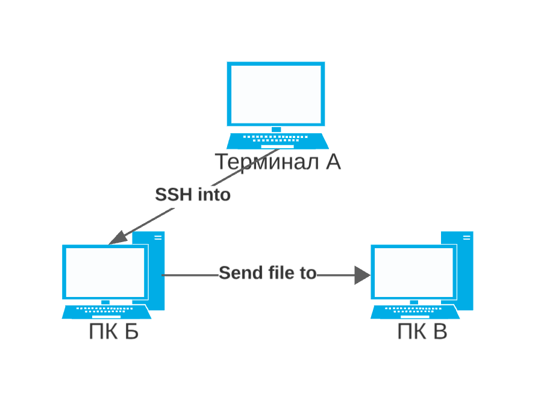

# Отчет по первой devops лабораторной работе
## Команда Облаке

## Условия

Пользуясь терминалом на компьютере А перенести файл с компьютера Б на компьютер С, находящиеся в одной локальной сети. (Подсказка: вам понадобится ssh).

Просьба использовать MacOS/Linux/WSL.

## Теоретическое построение задачи

Существует локальная сеть. Предположим, что мы знаем ip всек ПК

Получается, шаги простые:
- подключиться по ip через ssh (нет, ну а что еще может быть)
- отправить файл изветсному ip через scp, sftp или rsync

| scp | sftf| rsync |
| ---|:---:|---:|
| + Простота использования| + Безопасность| + Поддержка сжатия и шифрования |
| + Безопасность| + Расширенные возможности| + Поддержка удаленных и локальных операций|
| + Хорошая скорость| + Передача больших файлов | + Множество опций и возможностей|
| - Ограниченные функции| - Ресурсозатратный| - Требует наличие Rsync на обеих сторонах|
| - Ограничения в Windows| - Передача в два этапа| - Не подходит для реального времени|
| - Отсутствие автоматизации| - Сложность настройки| - Нет автоматической шифрованной аутентификации|

1. `ssh <IP-address>`
2. `scp myfile.txt remoteuser@remoteserver:/remote/folder/`

