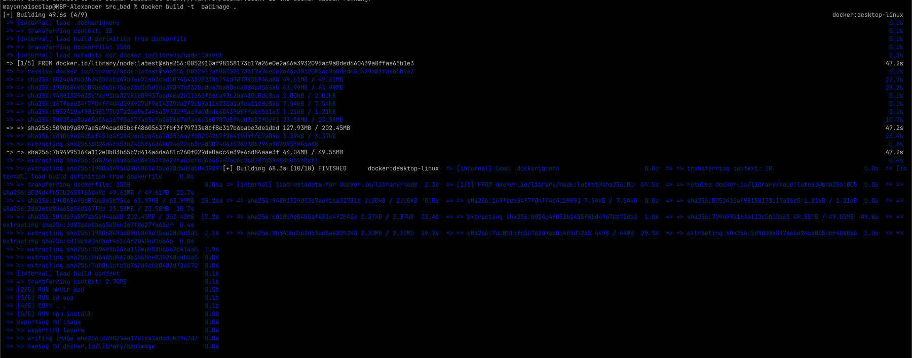
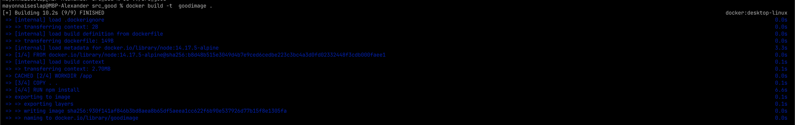

# Отчет по второй devops лабораторной работе

## Команда Облаке

## Условия

> Написать два Dockerfile – плохой и хороший. Плохой должен запускаться и работать корректно, но в нём должно быть не менее 3 “bad practices”. В хорошем Dockerfile они должны быть исправлены. В Readme описать все плохие практики из кода Dockerfile и почему они плохие, как они были исправлены в хорошем  Dockerfile, а также две плохие практики по использованию этого контейнера

## Теория

Контейнер - виртуальная среда с минимальным ядром и зависимостями для развертывания ПО в контроллируемой обстановке. Релиз контейнером упрощает отладку и тестирование ПО, устраняя возможные различия между разными физическими устройствами.

<!---
я люблю таблички
--->

### Хорошие и плохие практики

| Плохая практика | описание| Хорошая практика|
|---|---|---|
| Использование :latest без указания конкретной версии| Версия должна быть конкретной, иначе каждый раз мы можем получать разнае контейнеры| Лучше указать конкретную версию вместо latest, например python:3.8 |
| Использовать add| Если один из файлов изменится, весь кэш билда становится недействительным.| Использовать copy|
| Много отдельных команд RUN| Каждая команда добавляет новый слой| Вместо использования нескольких команд run использовать run 1 раз|
| Использовать команды типа RUN cd … && do-something| Использование команды WORKDIR добавляет ясности и надежности| Использовать WORKDIR|

---

## Разбор dockerfile

### Плохой

```dockerfile
FROM node:latest  <- использует latest. Можно было хуже, добавив ubuntu-latest, но там не запустился node. Однако, время сборки в разы больше

RUN mkdir app <-  | Бессмысленные RUN'ы, которые создают лишние слои
RUN cd app <-     |
COPY . .
RUN npm install <-|

CMD ["node","app.js"] <- cmd так-же не считается лучшей практикой
EXPOSE 3000:3010 <- зачем столько портов, если сервис работает на одном..? Тоже плохо так делать
```



### Хороший

```dockerfile
FROM node:14.17.5-alpine <- latest заменен на версию, также указана среда (минимальный дистрибутив alpine)

WORKDIR /app <- четко формируется структура файлов в контейнере
COPY . .
RUN npm install <- один RUN

ENTRYPOINT ["node","app.js"] <- Логичный entrypoint
EXPOSE 3005 <- один конкретный порт
```



### Сравнение контейнеров

|                 | Хороший | Плохой |
|-----------------|---------|--------|
| time to build   | 10s     | 50s    |
| image size      | 125mb   | 1.1gb  |

---

## Выводы

Очевидно, лучшие практики придуманы не просто так. На сравнениях понятно, насколько правильно написанный DOCKERFILE значительно упростит разработку и 
распостранение образа. Мы научились писать плохие и не сильно плохие DOCKERFILE'ы. 