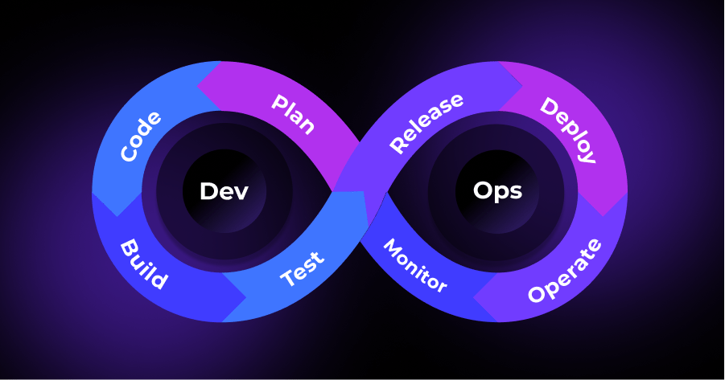

# Команда Облаке

**Вариант 11**

## Задача

>Опишите “лучшие практики” т.н. DevSecFinOps. Мы их разбирали на последней лекции, но необходимо из разложить именно в матрицу DevSecFinOps.

## Решение 

### Devops

Начнем с самого понятного нам Devops, который можно представить всем известной картинкой

Таким образом и разобьем анализ данной *ops дисциплины, но сначала обсудим что собственно предлагает эта идея. 

Ее суть заключается в предоставлении отлаженной системы/фреймворка для максимальной автоматизации каждого элемента создания и поддержки ПО. Devops позволяет более эффективно управлять ресурсами, требованиями  и самими проектами. Это достигается внедрением всего того инструментария, о котором речь пойдет ниже

#### Таблица

| Аспект | Описание практики | Чем хороша|  
|---|---|---|
| Plan| Devops предлагает применять идеи agile разработки, где планирование осуществляется на малом масштабе | Это позволяет динамично развивать ПО, имея гораздо меньший time-2-market. Решения принимаются исходя из актуальных данных |
| Code | Методология devops предлагает инструментарий для создания \*бесконечно\* масштабируемого ПО | k8s, serverless и прочие технологии позволяют применять одинаковый код на требуемом масщтабе и не заставляет вкладывать средства в избыточные вычислительные мощности. Также, например, стартап, ставший популярным за одну ночь теперь не упадет от наплыва клиентов и не потеряет oportunity cost| 
| Build| Этот и последующие пункты сфокусированы на автоматизации рутинных процессов. В данной стадии "цикла devops" описывается первая половина процесса CI. Подробности ниже| Автоматизация высвобождает дорогостоящее время разработчиков или даже более специализированных людей, что есть огромный плюс для бизнеса. Также уменьшается человеческий фактор для создания ошибок (банальный пример: debug флаг в бинарнике super mario 64) |
| Test| В этом пункте заключено как и автоматическое тестирование в рамках CI, так и работа с командрй QA. Также devops предполагает существование test среды, приближенной к prod. | Любой продукт должен работать, иначе он не будет иметь причину существовать. Тестирование является очень важной частью цикла разработки и это даже странно доказывать |
| Release| Тут может подразумеваться как автоматическое создание образа ПО для последующего деплоя, так и понятие канареечного релиза. Этот и следующий пункт объеденены в понятие CD | Канареечный релиз является процессом, предполагающим постепенную замену версий ПО для небольшой выборки клиентов, вместо массового релиза. Это позволяет как собрать данные A/B тестирования, так и обнаружить баги, прошедшие сквозь QA |
| Deploy| Деплой ПО является сложной и, при этом, рутинной задачей, поддающейся автоматизации.  |Будь то автоматическое обновление реестра контейнеров, управление траффиком для отсутствия перебоев в работе продукта или любая другая "боль", связанная с выкатыванием новой версии должна обслуживаться инструментарием devops | 
| Operate| | | 
| Monitor| Observability системы - важный критерий, который помогает в определении целей для следующего пункта - планирования | Логгирование всей системы способствующей к своевременному отлову багов, сбору информации по эффективности нововведений, так далее | 

#### CI

Continuous integration основывается на автоматизации всех процессов между написанием кода и его внедрении в кодовую базу. Вот неполный список вещей, которые могут быть частью CI:

- проверка на соответствие стилю (black, mypy, pylint)
- создание новых страниц с документацией из dockstring нового кода (javadoc)
- фиксирование версий зависимостей (venv, conda)
- сборка и загрузка в реестр образа для QA
- автоматическое тестирование
- прочее

Эти шаги реализовываются различным инструментарием: github/gitlub CI/CD, jenkins и другие

#### CD

Continuous deployment применяется для доставки клиентам обновленного ПО с минимальной "болью". Этот принцип применяет инструментарий, который предлагает виртуализация, чтобы доставлять ПО без downtime. CD позволяет уменьшить стоимость, время и риски внесения изменений путём более частных мелких обновлений в продакшн-приложение.  

| Практика | Описание практики | Чем хороша|  
|---|---|---|
| Мониторинг и остлеживание облачных затрат| Понимание, как используются различные сервисы, выявление факторов, влияющих на затраты, и отслеживание пользовательских тенденций.| Эта практика помогает определить области, где можно оптимизировать расходы, неиспользуемые ресурсы, и сервисы, которые уже не используются, но при этом на них тратятся финансы.|
| Внедрение стратегий по оптимизации расходов| После выявления факторов, влияющих на расходы, можно начать внедрять стратегии по оптимизации расходов. Например, использование скидок, сокращение неиспользуемых сервисов. Сначала нужно проанализировать расходы, определить области, где заметны растраты и непродуктивное использование ресурсов, а затем уже оптимизировать процессы.| Очевидное преомущество этой практики - снижение расходов и более оптимальное использование ресурсов.|
| Автоматизация управления облачными затратами| Автоматизация процессов управления облачными затратами поможет быстро выявить возможность сократить расходы, автоматизировать выделение ресурсов и выставление счетов, использовать рерсурсы облака "на все 100". Автоматизация также поможет найти возможности для использования скидок или акций от облачных провайдеров.| Оптимизация ресурсов и затрат.|
| Использование инструментов контроля затрат| Инструменты контроля затрат могут отслеживать пользовательские тенденции, ставить лимит на бюджет, и выявлять возможность оптимизации затрат.| Помогают внедрить стратегии оптимизации затрат и следить за расходами.|
| Внедрение стратегий распределния ресурсов| Распределять ресурсы как можно эффективнее, основываясь на шаблонах использования и стратегий оптимизации затрат.| Использовать имеющиеся ресурсы наиболее продуктивно - ключ к оптимизации расходов.|
| Прогнозирование затрат| Определить области, где можно сократить расходы, а также выявить затраты в будущем.| Помогает соотвествующе распределить бюджет.|
| Инвестирование в управление облаком| Установление правил, распределение ролей и обязанностей, контроль за соблюдением требований.| Помогает управлять облаком наиболее эффективно.|
